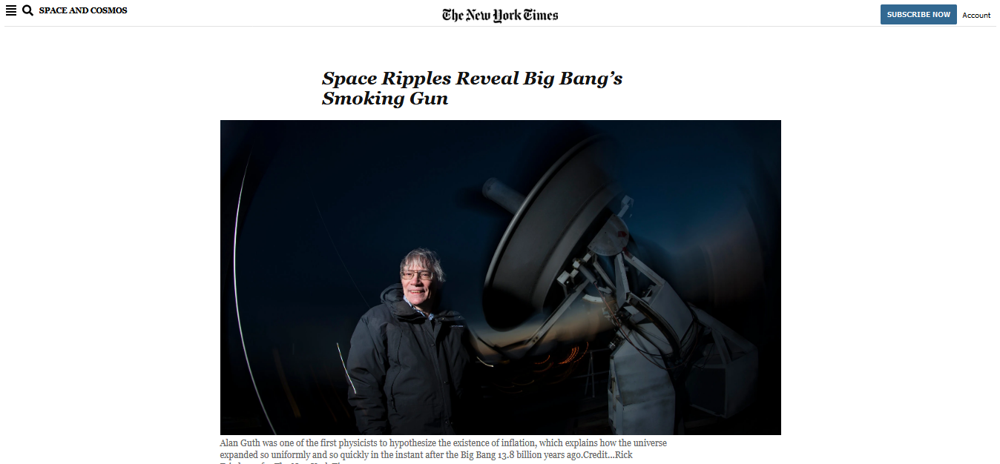

# NewYorkTimes Clone Page
HTML/CSS NewYorkTimes Web Page Clone (Microverse Project)
> One paragraph statement about the project.

Additional description about the project and its features.

## Built With
-HTML
-CSS

## Live Demo

[Live Demo Link](https://raw.githack.com/Takhmina175/NewYorkTimes_Clone_Page/magazine_clonePage/index.html)

## Authors

👤 **Takhmina175**

- GitHub: [@Takhmina175](https://github.com/Takhmina175)
- Twitter: [@Takhmina](https://twitter.com/Takhmin73630110)
- LinkedIn: [LinkedIn](https://www.linkedin.com/in/takhmina-makhkamova-7628136b/)

## 🤝 Contributing

Contributions, issues, and feature requests are welcome!

Feel free to check the [issues page](issues/).

## Show your support

Give a ⭐️ if you like this project!

## Acknowledgments

- Hat tip to anyone whose code was used
- Inspiration
- etc

## 📝 License

This project is [MIT](lic.url) licensed.
